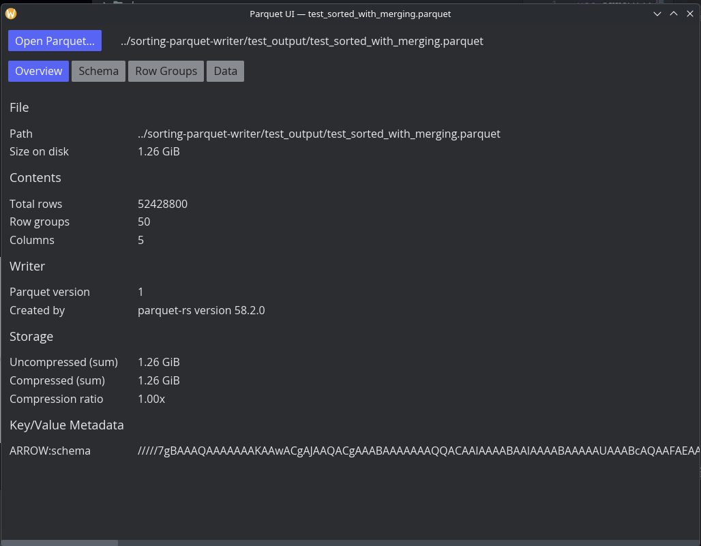
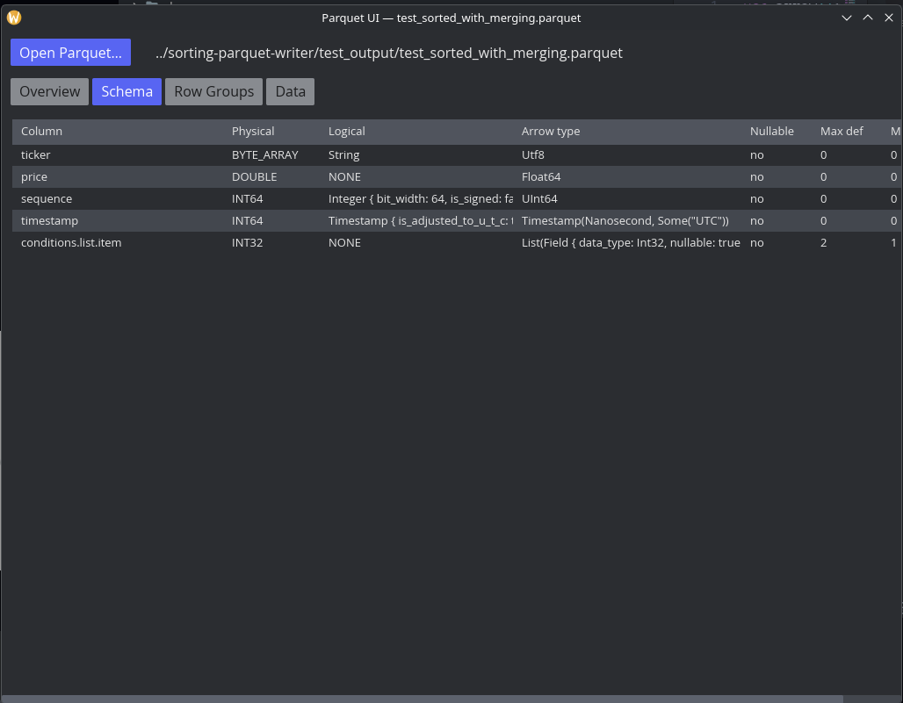
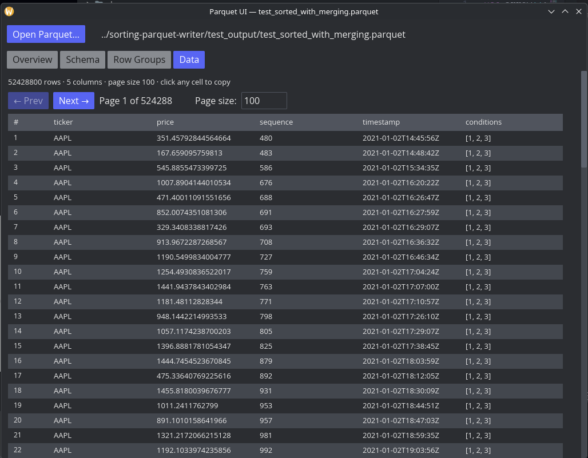

# parquet-ui

A simple desktop UI for inspecting [Apache Parquet](https://parquet.apache.org/) files. Built in Rust with [`iced`](https://iced.rs/), [`arrow`](https://crates.io/crates/arrow), and [`parquet`](https://crates.io/crates/parquet).

Open a file, browse its metadata, and page through the rows — no SQL, no editing, just a fast read-only viewer.

## Screenshots

| Overview | Schema | Data |
|---|---|---|
|  |  |  |

## Features

- **Overview** — file size, total rows, row group count, columns, writer (`created_by`), version, and summed compressed/uncompressed bytes with a compression ratio. Also lists any key/value file metadata.
- **Schema** — every column with its parquet physical type, logical type, the matching Arrow type, nullability, and max def/rep levels.
- **Row Groups** — one row per row group with sizes and column counts; click ▸ to expand a group and see per-column-chunk stats (compression, encodings, value count, sizes, and min/max/null counts).
- **Data** — paginated grid of the actual rows, with a configurable page size. Hover a column header to see its Arrow data type.
- **Click-to-copy** — clicking any cell in the Schema, Row Groups, or Data tables copies its full text value to the clipboard (useful for cells that are visually truncated).
- **Horizontal + vertical scrolling** for tables wider than the window.
- **CLI argument** — pass a file path to open it on launch.

## Build

Requires a recent Rust toolchain (edition 2024 — Rust 1.85+).

```sh
git clone https://github.com/wyatt-herkamp/parquet-ui
cd parquet-ui
cargo build --release
```

The binary lands at `target/release/parquet-ui`.

## Run

```sh
# Empty window — use the "Open Parquet…" button
cargo run --release

# Open a file directly
cargo run --release -- /path/to/file.parquet

# Or after installing the binary:
parquet-ui /path/to/file.parquet
```

## Install (Linux)

Install the binary somewhere on your `PATH`, then install the `.desktop` file so file managers list parquet-ui as a handler for `.parquet` files.

```sh
# Binary
cargo build --release
install -Dm755 target/release/parquet-ui ~/.local/bin/parquet-ui

# Desktop entry
install -Dm644 packaging/parquet-ui.desktop \
    ~/.local/share/applications/parquet-ui.desktop

# Refresh the desktop database (some environments)
update-desktop-database ~/.local/share/applications 2>/dev/null || true
```

After this, right-clicking a `.parquet` file in your file manager should offer **Open with → Parquet UI**, and you can make it the default with **Properties → Open With**.

To install system-wide instead, replace `~/.local/bin` with `/usr/local/bin` and `~/.local/share/applications` with `/usr/share/applications` (needs root).

## Tabs at a glance

| Tab | Source | Notes |
|---|---|---|
| Overview | `FileMetaData` | One-shot read from the file footer. |
| Schema | `SchemaDescriptor` + Arrow `Schema` | Joined per column index. |
| Row Groups | `RowGroupMetaData` + `ColumnChunkMetaData` | Lazy — column stats render only for the expanded group. |
| Data | `ParquetRecordBatchReaderBuilder` | Each page is a fresh reader with `with_offset` + `with_limit`. |

All disk I/O runs on `tokio::task::spawn_blocking` so the UI stays responsive on large files. Only the requested page is read into memory — opening a million-row file doesn't load a million rows.

## License

Dual-licensed under MIT or Apache-2.0, at your option.
